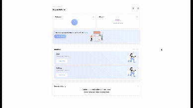

# Daynes Gym Buddy



**Daynes Gym Buddy is a PWA web app designed to track weight and calories while also acting as a way for users to store exercises and build their own workout routines.**

---

## Tech Stack

| Layer | Technology |
| --- | --- |
| **Client** | React 19, TypeScript, Tailwind CSS 4, Vite |
| **Server** | Node.js, Express 5, TypeScript |
| **Database** | PostgreSQL, Prisma ORM |
| **Auth** | JWT (access + refresh tokens), Argon2 password hashing |
| **Charts** | Recharts |
| **Animations** | Framer Motion |
| **PWA** | vite-plugin-pwa |

---

## Features

### Authentication

- Register and login with email/password
- JWT-based auth with short-lived access tokens and rotating refresh tokens stored in HTTP-only cookies
- Onboarding flow to set goal weight and daily calorie target

### Dashboard

- At-a-glance summary of your week: calories, weight trend, and routines

### Calories

- Log daily calorie intake
- Progress bar against your daily calorie goal
- Filter logs by date range

### Weight

- Log daily weight
- Interactive line chart of weight over time
- Stats card showing current, goal, and change

### Exercises

- Seeded global exercise library (shared across all users)
- Create custom exercises with name, muscle group, description, and media URL

### Routines

- Full CRUD for workout routines
- Attach exercises to a routine with target sets, reps, and optional target weight
- Drag-to-reorder exercises within a routine

---

## Project Structure

```text
daynes-gym-buddy/
├── client/          # React PWA (Vite)
│   └── src/
│       ├── app/         # Router, layouts
│       ├── components/  # Shared UI components
│       ├── features/    # Feature-scoped pages, hooks, components
│       │   ├── auth/
│       │   ├── calories/
│       │   ├── dashboard/
│       │   ├── exercises/
│       │   ├── routines/
│       │   └── weight/
│       └── services/    # API client
├── server/          # Express API (Node.js)
│   └── src/
│       ├── controllers/ # Request handlers
│       ├── services/    # Business logic
│       ├── repositories/# Database access via Prisma
│       ├── routes/      # Route definitions
│       ├── middleware/  # Auth, error handling
│       └── seed/        # Exercise seed data
└── docs/            # API reference, DB schema, env examples
```

---

## Getting Started

### Prerequisites

- Node.js 20+
- PostgreSQL database

### 1. Clone and install

```bash
git clone https://github.com/daynes/daynes-gym-buddy.git
cd daynes-gym-buddy

# Install server dependencies
cd server && npm install

# Install client dependencies
cd ../client && npm install
```

### 2. Configure environment variables

**Server** — copy `docs/server/.env.example` to `server/.env` and fill in your values:

```env
NODE_ENV=development

ACCESS_TOKEN_SECRET=your_access_secret
REFRESH_TOKEN_SECRET=your_refresh_secret

ACCESS_TOKEN_EXPIRES_MINUTES=172800
REFRESH_TOKEN_EXPIRES_DAYS=7

PORT=3000
CLIENT_URL=http://localhost:5173

DATABASE_URL="postgresql://user@localhost:5432/fitness_tracker"
```

**Client** — copy `docs/client/.env.example` to `client/.env`:

```env
VITE_BACKEND_URL=http://localhost:3000/api
```

### 3. Run database migrations and seed exercises

```bash
cd server
npx prisma migrate dev
npm run seed:users
```

### 4. Start the development servers

```bash
# Terminal 1 — server
cd server && npm run dev

# Terminal 2 — client
cd client && npm run dev
```

The app will be available at `http://localhost:5173`.

---

## API Reference

See [docs/server/API.md](docs/server/API.md) for the full endpoint reference.

A Postman collection is available at [docs/server/daynes_gym_buddy.postman_collection.json](docs/server/daynes_gym_buddy.postman_collection.json).

---

## Database Schema

See [docs/server/DATABASE.md](docs/server/DATABASE.md) for table definitions, and [docs/server/app_db_schema.svg](docs/server/app_db_schema.svg) for an entity-relationship diagram.

---

## Scripts

| Directory | Command | Description |
| --- | --- | --- |
| `server` | `npm run dev` | Start server with hot reload |
| `server` | `npm run build` | Compile TypeScript for production |
| `server` | `npm start` | Run production build (runs migrations first) |
| `server` | `npm run seed:users` | Seed the database with exercises |
| `client` | `npm run dev` | Start Vite dev server |
| `client` | `npm run build` | Build for production |
| `client` | `npm run lint` | Run ESLint |
